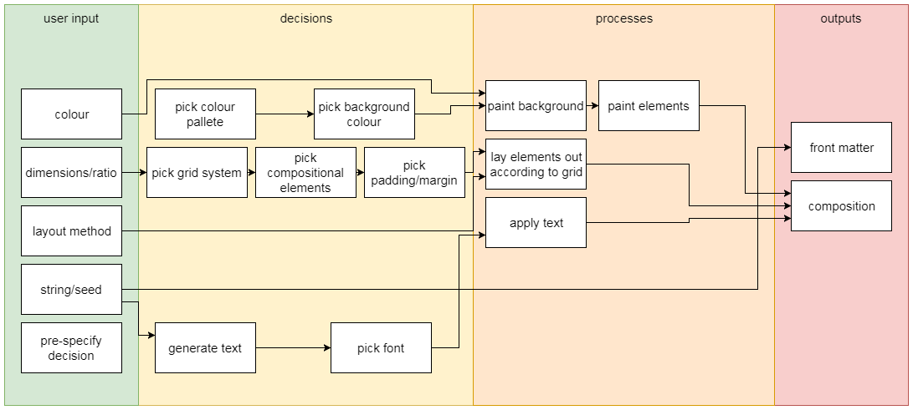
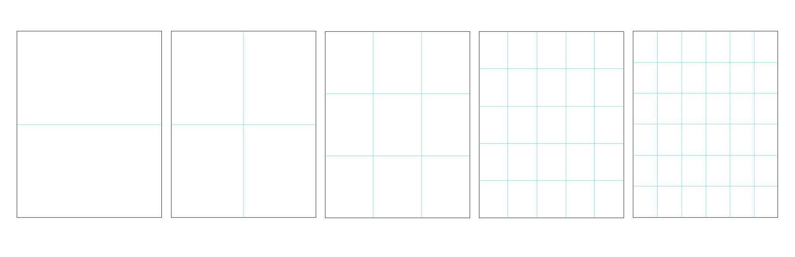
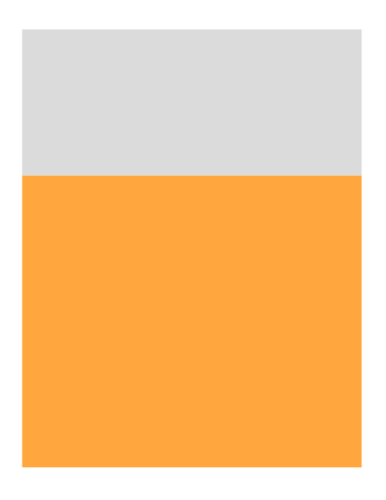
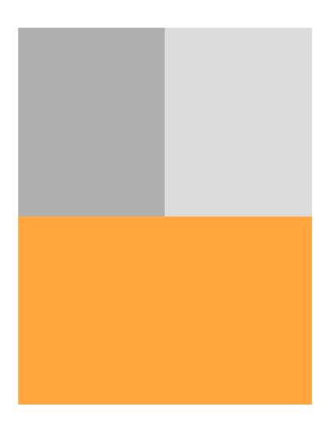

# Swissbot :switzerland:
:warning: **This project is a work in progress**:construction: :warning:

Generating compositions in the [International Typographic Style](https://en.wikipedia.org/wiki/International_Typographic_Style)

## Colour
Colour palettes are generated using the [colormind.io API](http://colormind.io/api-access/)
## Grid Systems
### Equilateral Grids
Grid divided into Halves, Thirds, Quarters, Fifths, Sixths ,etc...

### Golden Ratio

Grid based on [Golden Ratio](https://en.wikipedia.org/wiki/Golden_ratio) derived from [Fibonacci sequence](https://en.wikipedia.org/wiki/Fibonacci_number) where the next number in the sequence is equal to the sum of the last two numbers. Roughly 1:1.61803
## Layout Methods
### Asymmetrically

### Binary Space Partitioning

### Implied Depth / Hierarchical

## Fonts
Grotesk google fonts:
- [Questrial](https://fonts.google.com/specimen/Questrial)
- [Roboto](https://fonts.google.com/specimen/Roboto)
- [Karla](https://fonts.google.com/specimen/Karla)